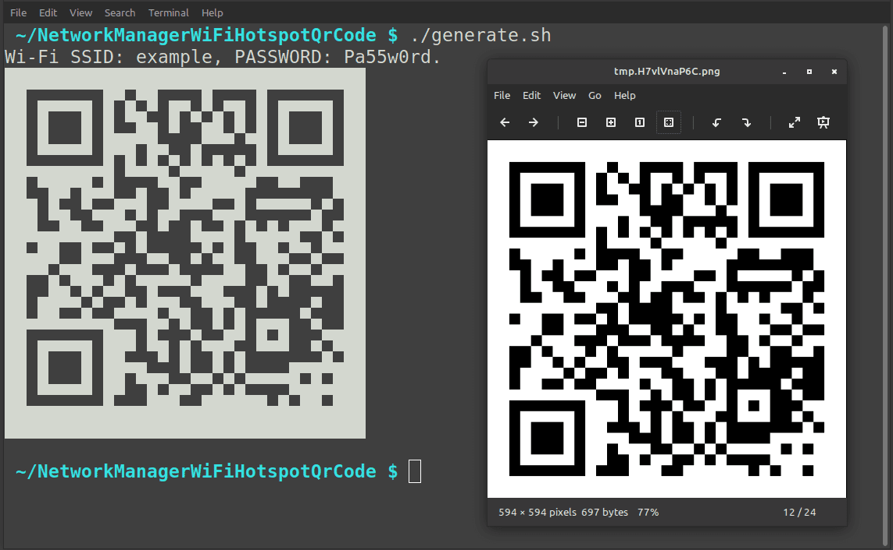

# NetworkManagerWiFiHotspotQrCode

A simple shell script, to retrieve the latest Wi-Fi hotspot information enabled by "[GNOME NetworkManager](https://wiki.gnome.org/Projects/NetworkManager)", and generate a WI-Fi QR code that containing the Wi-Fi SSID and password, so that those mobile devices can easily scan it, to connect to the Wi-Fi Hotspot.

## Dependency

- [qrencode](https://fukuchi.org/works/qrencode/index.html.en) command

## Usage

```sh
~/NetworkManagerWiFiHotspotQrCode $ ./generate.sh
Wi-Fi SSID: example, PASSWORD: Pa55w0rd.
█████████████████████████████████
██ ▄▄▄▄▄ █▀▄▀█ ▄▄ █ ▄▄ █ ▄▄▄▄▄ ██
██ █   █ █ ▀█▄ █ ▀▄█ █ █ █   █ ██
██ █▄▄▄█ ███▀█▄  ▄▀▀▀ ▀█ █▄▄▄█ ██
██▄▄▄▄▄▄▄█ █▄█▄▀▄█▄█▄▀▄█▄▄▄▄▄▄▄██
██ ▀██▀█▄█  ▄ ▀█ ▄████▀  ▀▀   ███
███ █▄ ▀▄▄█▀█ ▄█▀▀▀▄▄█ ▀▀▀▀▀▄▀ ██
███▄▄██▄▄█▀▀▄ ▀  █▄▄█ █▄█▄█▀▀▄▀██
██▄██  █▄▄▀ ▀▄▄  ▄▀▄█  ██▄▀▀▄▀▀██
██▀▀▄▀██▄ ▄▀▄▄▄█▄ ▄▄██  █▄▀▀▄█▀██
██ ▄██▄▀▄▀▀▄ █▄▄ ▀██▄  █ ▀  ▄  ██
██▄██▄▄█▄▄▀▀▀█▄▀█  █ █ ▄▄▄ ▀▄  ██
██ ▄▄▄▄▄ ███ █▄ ▄▀▄▄█▀ █▄█  ▄▀███
██ █   █ ██▄▄ ▀ █  █ █    ▄▄▄█▄██
██ █▄▄▄█ ██ ▀█▀▄▄▀▀▄▀▄▀▀▀▀█▄█▄███
██▄▄▄▄▄▄▄█▄▄▄███▄▄██████▄█▄██▄███
█████████████████████████████████
```

## Screenshot


